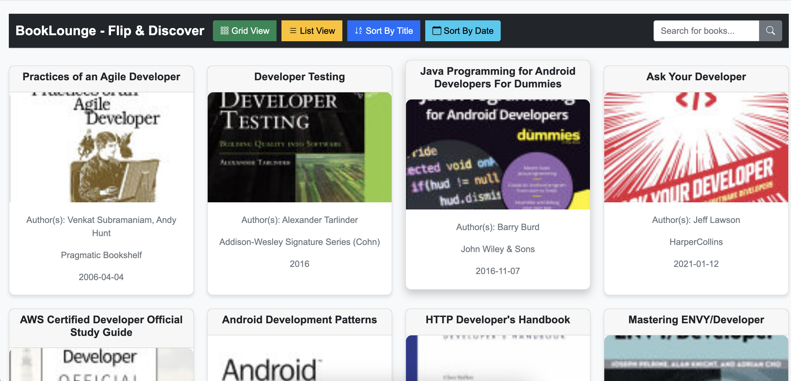

# *BookLounge - A Book Library*

BookLounge is a web application designed to allow users to explore a vast collection of books. With features like searching, sorting by title or date, and toggling between grid or list view, BookLounge provides a user-friendly interface for book lovers to discover new reads.

---

## Demo  


---

## Live Project URL  
[Live URL](https://book-lounge.vercel.app/)

---

## Features
1. **Grid and List View Toggle**: Switch between grid or list view to display books in your preferred format.
2. **Book Sorting**: Sort books by title or published date for easier browsing.
3. **Search Functionality**: Find books quickly using the search bar to filter by title or author.
4. **Book Details**: Click on a book’s thumbnail to open more details about it in a new tab.
5. **Pagination**: Navigate between pages of books with previous and next buttons for better browsing.

---

## Installation
To use this application locally, follow these steps:

1. Clone the repository:

    ```bash
    git clone https://github.com/sourav-maji/BookLounge
    ```

2. Navigate into the project folder:

    ```bash
    cd BookLounge
    ```

3. Open the `index.html` file in your browser to view the application. Simply double-click `index.html` or open it in any modern web browser.

---

## Files

1. **index.html**: The main HTML file containing the structure of the application, including the navigation bar, search bar, and book display area.
2. **styles.css**: The CSS file that styles the application, including responsive layout adjustments and theme settings.
3. **script.js**: The JavaScript file that handles fetching book data from an API, rendering the books, implementing pagination, and managing user interactions (search, sort, view toggle).
4. **README.md**: This file that explains the setup and usage of the project.

---

## Usage
- **Grid View / List View Toggle**: Use the "Grid View" and "List View" buttons to toggle between different book display formats.
- **Search for Books**: Type a book title or author into the search bar and click the search button to filter the books.
- **Sorting**: Click the "Sort By Title" or "Sort By Date" buttons to sort the books accordingly.
- **Pagination**: Use the "Previous" and "Next" buttons to navigate between pages of books.
- **Book Details**: Click on a book's thumbnail to open its details in a new tab.

---

## Dependencies

1. **Bootstrap 5**: For responsive and modern layout design.
2. **Bootstrap Icons**: For various UI icons used in the navigation bar and buttons.
3. **Fetch API**: Used for making HTTP requests to fetch book data from an external API.

--- 


